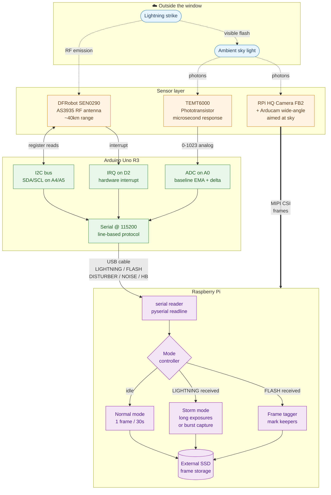

```mermaid

flowchart TB
    subgraph Sky["☁️ Outside the window"]
        STORM([Lightning strike])
        AMBIENT([Ambient sky light])
    end

    subgraph Sensors["Sensor layer"]
        AS3935["DFRobot SEN0290<br/>AS3935 RF antenna<br/>~40km range"]
        TEMT["TEMT6000<br/>Phototransistor<br/>microsecond response"]
        CAM["RPi HQ Camera FB2<br/>+ Arducam wide-angle<br/>aimed at sky"]
    end

    subgraph Arduino["Arduino Uno R3"]
        I2C["I2C bus<br/>SDA/SCL on A4/A5"]
        IRQ["IRQ on D2<br/>hardware interrupt"]
        ADC["ADC on A0<br/>baseline EMA + delta"]
        SERIAL["Serial @ 115200<br/>line-based protocol"]

        I2C --> SERIAL
        IRQ --> SERIAL
        ADC --> SERIAL
    end

    subgraph Pi["Raspberry Pi"]
        READER["serial reader<br/>pyserial readline"]
        STATE{"Mode<br/>controller"}
        TIMELAPSE["Normal mode<br/>1 frame / 30s"]
        STORMMODE["Storm mode<br/>long exposures<br/>or burst capture"]
        TAGGER["Frame tagger<br/>mark keepers"]
        SSD[("External SSD<br/>frame storage")]

        READER --> STATE
        STATE -->|idle| TIMELAPSE
        STATE -->|LIGHTNING received| STORMMODE
        STATE -->|FLASH received| TAGGER
        TIMELAPSE --> SSD
        STORMMODE --> SSD
        TAGGER --> SSD
    end

    STORM -.RF emission.-> AS3935
    STORM -.visible flash.-> AMBIENT
    AMBIENT -.photons.-> TEMT
    AMBIENT -.photons.-> CAM

    AS3935 -->|interrupt| IRQ
    AS3935 <-->|register reads| I2C
    TEMT -->|0-1023 analog| ADC

    SERIAL -->|USB cable<br/>LIGHTNING / FLASH<br/>DISTURBER / NOISE / HB| READER

    CAM ===>|MIPI CSI<br/>frames| Pi

    classDef sky fill:#e8f4ff,stroke:#4a90c2,color:#1a3a5c
    classDef sensor fill:#fff4e6,stroke:#d68910,color:#5c3a1a
    classDef ard fill:#e8f5e9,stroke:#388e3c,color:#1b5e20
    classDef pi fill:#f3e5f5,stroke:#8e24aa,color:#4a148c

    class STORM,AMBIENT sky
    class AS3935,TEMT,CAM sensor
    class I2C,IRQ,ADC,SERIAL ard
    class READER,STATE,TIMELAPSE,STORMMODE,TAGGER,SSD pi
```